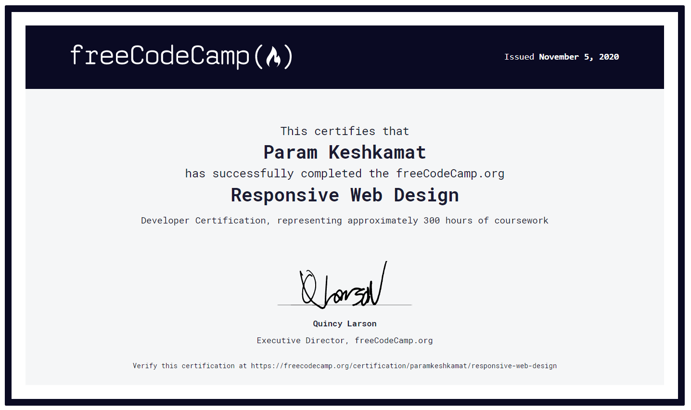

# FreeCodeCamp-Responsive-WebDesign-Certificaton
I Completed the Free Code Camp Responsive Web Design Certification and this repository contains source code of all the small projects which I made during this course.

Link to all the Web Pages I created during this project
1. Tribute Page -> https://codepen.io/paramkeshkamat/full/PozaxJE
2. Survey Form -> https://codepen.io/paramkeshkamat/full/MWeXdyE
3. Product Landing Page -> https://codepen.io/paramkeshkamat/full/wvWxwJW
4. Technical Documentation Page -> https://codepen.io/paramkeshkamat/full/jOrpBRW
5. Personal Portfolio Webpage -> https://codepen.io/paramkeshkamat/full/pobZayR

Certificate which I achieved after completing the course

